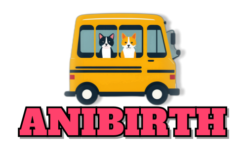

# 

## 🚀프로젝트 명 : AniBirth(애니버스)
- 웹 URL : https://www.anibirth.shop
- DB PORT : 3306
- DB username : root
- 데이터베이스 이름 : anibirth_dev

## 📢 프로젝트 개요
- 유기동물의 삶의 질 개선 및 입양률 상승
- 유기동물 보호소에 대한 관심도 상승과 지원 강화
- 유기동물 봉사를 통한 유기동물들의 건강과 복지 증진
- 유기동물 문제에 대한 인식 높이기

## ⏱️개발 기간

- 전체 개발 기간 : 2024-07-15 ~ 2024-09-02
- 프로젝트 주제 선정 기간 : 2024-07-15 ~ 2024-07-19
- UI 구현 : 2024-07-20 ~ 2024-09-02
- 기능 구현 : 2024-07-20 ~ 2024-09-02

## ⚙ 개발 환경
- 운영체제 : Windows 10, 11
- 통합개발환경(IDE) : IntelliJ
- JDK 버전 : JDK 21
- 데이터 베이스 : MySQL
- 빌드 툴 : Gradle
- 관리 툴 : GitHub

## 🔌 Dependencies
- Spring Boot DevTools
- Lombok
- Spring Data JPA
- MariaDB Driver
- Spring Security
- Spring Web
- Oauth2-client
- Thymeleaf
- Validation
- Jackson (공공데이터 OpenAPI)
- Toss Payments
- FullCalendar

## 💻 기술 스택
- 백엔드
    - SpringBoot, Spring Security, Spring Data JPA
- 프론트엔드
    - HTML, CSS, Javascript, Bootstrap, Thymeleaf, jQuery, Tailwind
- 데이터베이스
    - MariaDB, MySQL Workbench
    - MySQL, SQLyog, DBeaver
